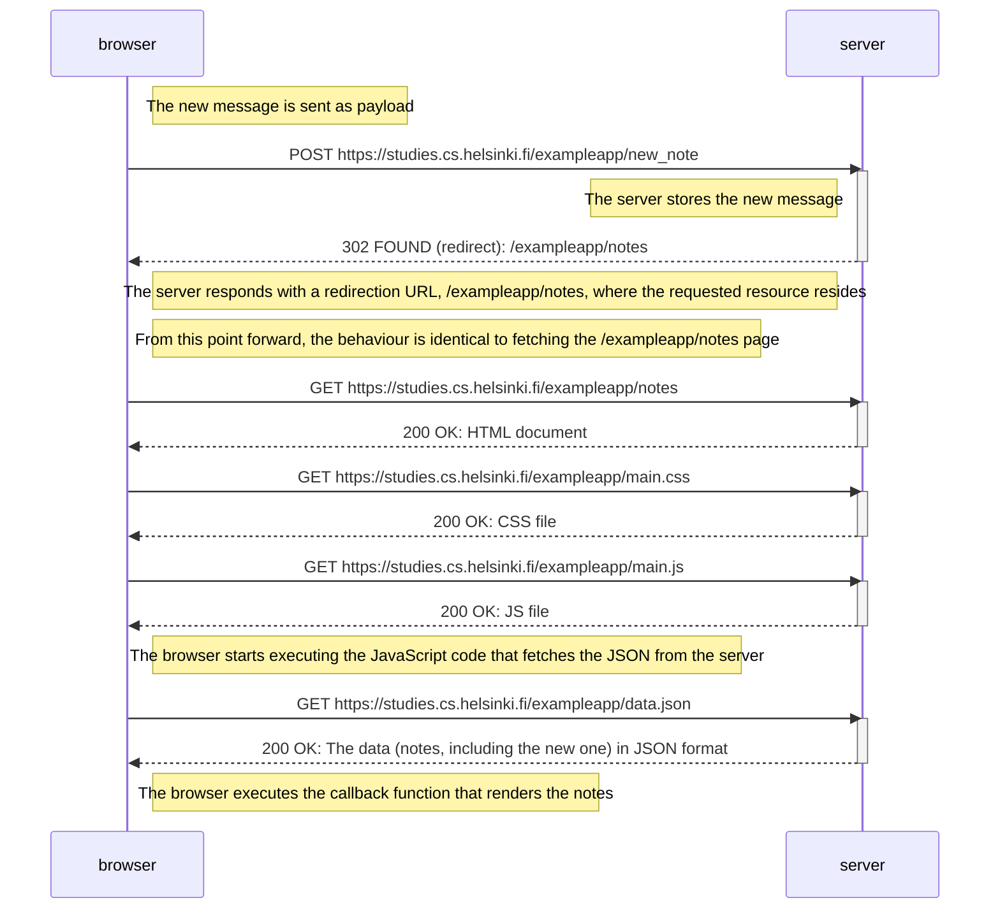

```mermaid
sequenceDiagram
  participant browser
  participant server

  Note right of browser: The new message is sent as payload

  browser->>server: POST https://studies.cs.helsinki.fi/exampleapp/new_note

  activate server

  Note left of server: The server stores the new message

  server-->>browser: 302 FOUND (redirect): /exampleapp/notes
  deactivate server

  Note left of server: The server responds with a redirection URL, /exampleapp/notes, where the requested resource resides

  Note right of browser: From this point forward, the behaviour is identical to fetching the /exampleapp/notes page

  browser->>server: GET https://studies.cs.helsinki.fi/exampleapp/notes
  activate server
  server-->>browser: 200 OK: HTML document
  deactivate server
  browser->>server: GET https://studies.cs.helsinki.fi/exampleapp/main.css
  activate server
  server-->>browser: 200 OK: CSS file
  deactivate server
  browser->>server: GET https://studies.cs.helsinki.fi/exampleapp/main.js
  activate server
  server-->>browser: 200 OK: JS file
  deactivate server

  Note right of browser: The browser starts executing the JavaScript code that fetches the JSON from the server

  browser->>server: GET https://studies.cs.helsinki.fi/exampleapp/data.json
  activate server
  server-->>browser: 200 OK: The data (notes, including the new one) in JSON format
  deactivate server

  Note right of browser: The browser executes the callback function that renders the notes
```
