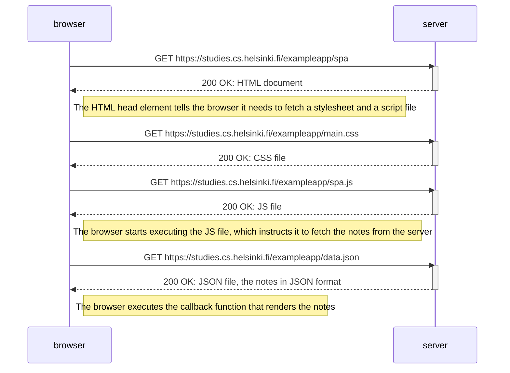

This one doesn't particularly differ from the example case given in the study material.

```mermaid
sequenceDiagram

  participant browser
  participant server

  browser->>server: GET https://studies.cs.helsinki.fi/exampleapp/spa
  activate server
  server-->>browser: 200 OK: HTML document
  deactivate server

  Note right of browser: The HTML head element tells the browser it needs to fetch a stylesheet and a script file

  browser->>server: GET https://studies.cs.helsinki.fi/exampleapp/main.css
  activate server
  server-->>browser: 200 OK: CSS file
  deactivate server

  browser->>server: GET https://studies.cs.helsinki.fi/exampleapp/spa.js
  activate server
  server-->>browser: 200 OK: JS file
  deactivate server

  Note right of browser: The browser starts executing the JS file, which instructs it to fetch the notes from the server

  browser->>server: GET https://studies.cs.helsinki.fi/exampleapp/data.json
  activate server
  server-->>browser: 200 OK: JSON file, the notes in JSON format
  deactivate server

  Note right of browser: The browser executes the callback function that renders the notes
```
