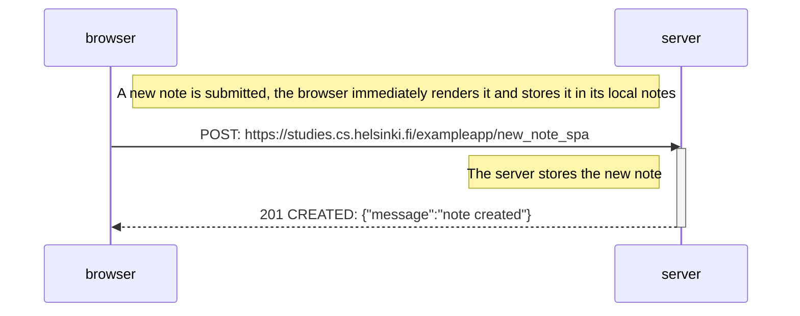

```mermaid
sequenceDiagram

  participant browser
  participant server

  Note right of browser: A new note is submitted, the browser immediately renders it and stores it in its local notes
  browser->>server: POST: https://studies.cs.helsinki.fi/exampleapp/new_note_spa
  activate server
  Note left of server: The server stores the new note
  server-->>browser: 201 CREATED: {"message":"note created"}
  deactivate server
```
